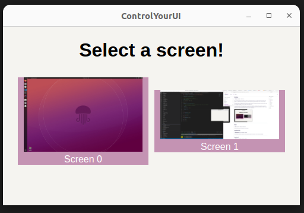

# askui UI Controller

## Properties

### binaryVersion

- **binaryVersion**: `string` - Default: `latest`

There are different versions of the askui UI Controller. Not all versions are supported for all operating systems.
You can specify which binary version of server you want to download and use. The default value is `latest` which will
download the newest version.
___

### display

- **display**: `number` - Default: `0`

You can choose on which display you want to excecute all
tests. You can only perform all tests on one display.
The application which you want to test should be open and selected on your chosen display.

The default value of display is `0` which is your main monitor. If you want to use your
second monitor you can change the value to `1` (`2` for your third monitor etc.).

There is also a possibility to detect the value of your monitors.
After the start of the askui UI Controller you should see an askui icon. After clicking on this icon you can choose the option `Show`.
You will see the same window as the following image.



 Now you can identify the order of your monitors and you can also select the monitor in this configuration.

___

### host

- **host**: `string` - Default: `127.0.0.1`

The host the askui UI Controller is running on.

### logFilePath

- **logFilePath**: `string` - Default: `<temp-dir>/askui/askui-server.log`

It is possible to specify a path for your log files. Per default we create the askui-server.log file and askui folder in your temp folder.
___

### logLevel

- **logLevel**: `LogLevels` - Default: `debug`

You can set the log level using the `LogLevels`. The following values are available: `"fatal"`, `"error"`, `"warn"`, `"info"`, `"debug"`, `"trace"`, `"silent"`, `"verbose"`. All log levels are defined in an `LogLevels` enum.
___

### minimize

- **minimize**: `boolean` - Default: `true`

The default value of this property is `true`. This means that
askui UI Controller will be started as minimized window.
___

### overWriteBinary

- **overWriteBinary**: `boolean` - Default: `false`

Download the provided Version of askui UI Controller. If a version is already downloaded. This version will be overwritten.
___

### port

- **port**: `number` - Default: `6769`

The port the askui UI Controller is running on.
___

### actionDelayInMs

- **actionDelayInMs**: `number` - Default: `1000`

`actionDelayInMs` is the time that the askui UI controller waits between actions. This can be used to slow down or speed up the execution.

Let's say, you want to click on the login button and then navigate to the home page by clicking on the home button but you have to wait 2s before clicking it because it takes some time logging in. You can increase the `actionDelayInMs` to `2000` in this case. But be careful, as it is going to slow down all your test steps. It may be better to use [waitFor()](../02-Actions/waitfor.md) between the two clicking actions.

## Example

```typescript
import { UiControlClient, UiController, LogLevels } from 'askui';

describe('jest with askui', () => {
  
  // Server for controlling the operating system
  let uiController: UiController;
  
  beforeAll(async () => {
    uiController = new UiController({
    
      // choosing the second monitor 
      display: 1,

      // download the latest version of the server
      binaryVersion: 'latest',

      // start askui UI Controller as minimized application
      minimize: true,

      // using error loglevel
      logLevel: LogLevels.ERROR,

      // Set the action delay lower than the default
      actionDelayInMs: 500,

    });
  })
})
```
