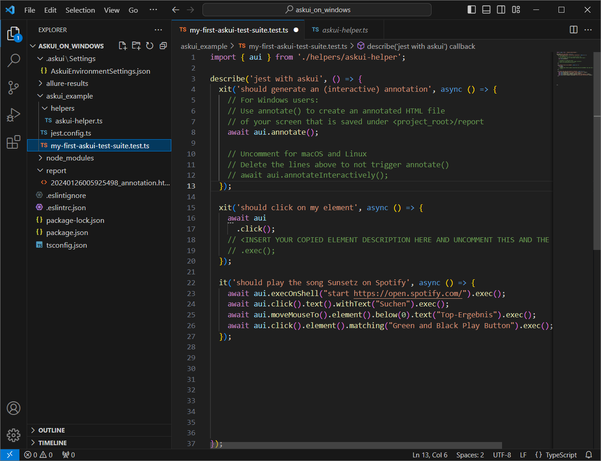

# AskUI on Windows

## Prerequisites

Check if you have the following requirements, before you start the process.
- You need an AskUI account. Don't have one? Register for a free trial [here](https://xa5a040gvfz.typeform.com/to/IHdr0qY5)!
- Make sure you have Administrator privileges on the computer, where you want to use AskUI.
- Consider using an IDE. We recommend [Visual Studio Code](https://code.visualstudio.com/).

## Setup

### Step 1: Download Installer
Download the AskUI Installer [here](https://files.askui.com/releases/Installer/24.2.2/AskUI-Suite-24.2.2-System-Installer-Win-AMD64-Full.exe).

It will install the following components:

* [AskUI Controller](../../02-Components/AskUI-Controller.md)
* [AskUI Development Environment (ADE)](../../02-Components/AskUI-Development-Environment.md)
* AskUI Development Kit (SDK)
* (optional) [AskUI Runner (Executing workflows from AskUI Studio)](../../02-Components/AskUI-Runner.md)

### Step 2: Setup AskUI on Your Computer
Run the downloaded installer as **Administrator** (Rightclick the installer and select **Run as administrator**).

:::info
The installer prompts Windows to display a security alert. Click on `More Info` in the top left and then on `Run Anyway` in the bottom right corner of the dialog to proceed with the installation.
:::

Next, follow the instructions in the setup wizard until the end.

#### Alternative: Installation via Terminal (Silent Mode)
Use the downloaded executable file (**.exe**) for silent installation, which allows you to choose the installation directory and components. To install silently, run the following command terminal (Application **CMD**) with Administrator privileges:

```shell
"<installer_path>" /qn
```

#### Options:

- `/l*v "<log_file_path>"`: Set the installer log file path.
- `APPDIR="<installation_directory>"`: Specify the installation directory.
- `INSTALL_ADK="NO"`: Skip AskUI Development Environment installation.
    - `INSTALL_NODE="NO"`: Skip Isolated Node environment installation.
    - `INSTALL_ASKUI_RUNNER="NO"`: Skip AskUI Runner installation.
    - `HTTP_PROXY="<http_proxy_address>"`: Set the HTTP proxy address.
    - `HTTPS_PROXY="<https_proxy_address>"`: Set the HTTPS proxy address.
- `CONFIGURE_WINDOWS_FIREWALL="NO"`: Skip Windows Firewall configuration.

#### Example:
This command installs all components silently and sets the HTTP proxy address to http://proxy.example.com:

```shell
"<installer_path>" /qn HTTP_PROXY="http://proxy.example.com"
```

### Step 3: Activate the AskUI Development Environment (ADE)
1. Open a terminal. We recommend using *PowerShell*.
2. Run the command `askui-shell` (type it and press _Enter_). This brings you into the AskUI Development Environment (short ADE) where you can configure your installation, start the AskUI Controller, create new AskUI-Projects and run workflows.

Activating the ADE may take a few seconds.

:::info
If you are not what an ADE command does, you can run `Get-Help <command>` to get more information about it.
:::

### Step 4: Connect Your AskUI Account

:::info
As we need to prevent misuse of our API, we need you to create some credentials through our __AskUI Studio__ (for free).

Please [fill out this form](https://xa5a040gvfz.typeform.com/to/Ndh2NkV6) to schedule a demonstration or [request a trial](https://xa5a040gvfz.typeform.com/to/IHdr0qY5) to obtain access to __AskUI Studio__.
:::

Run the following command to authenticate and connect your ADE to your AskUI account. Replace `<access token>` and `<workspace id>` with your real credentials.

- **Access Token** You can create a new access token inside our web app. Go to any Workspace and navigate to *Access Tokens* in the left sidebar.
- **Workspace ID** Navigate to your workspace's settings. You can find the workspace ID under *General* below the workspace's name.

```shell
AskUI-SetSettings -WorkspaceId <workspace id> -Token <access token>
```

Validate the settings with the following command: 

```shell
AskUI-ShowSettings
```

### Step 5: (Optional) Configure Proxy
If you are behind a proxy you have to set the proxy address. Replace `<http_proxy_address>` and `<https_proxy_address>` with the ones for your proxy:

```shell
AskUI-SetSettings -HttpProxy <http_proxy_address> -HttpsProxy <https_proxy_address>
```
If you have already configured your proxy settings in the setup wizard, you can skip this step.

:::info
Configuring proxy or firewall settings can be a challenge. If you need assistance with this task, feel free to schedule a call with our enterprise support team [here](https://calendly.com/d/3m3-myw-9z7/askui-enterprise-onboarding-assistance).
:::

### Step 6: Start the Controller

:::info
You have to disable mouse acceleration for the AskUI Controller to work properly!
:::

Start the AskUI Controller with:

```shell
AskUI-StartController
```

Open another command prompt and [activate the _ADE_](#step-3-activate-the-askui-development-environment-ade) there again.

Alternatively start the AskUI Controller in the background to keep using the same command prompt:

```shell
AskUI-StartController -RunInBackground
```

Press _Enter_ to return to the _ADE_.

### Step 7: Create a New Project
Switch to a directory where you want to create the new AskUI project and run:

```shell
AskUI-NewProject -ProjectName askui_first -TestFramework jest -TypeScriptConfig true
```

### Step 8: Open Your Project
Your new AskUI project has now been created inside the folder you specified and it's path is set as your current working directory: `<path you ran AskUI-NewProject>/<your_askui_project_name>`.

Now open this folder with your IDE of choice.

If you are using Visual Studio Code, you can run the following command in the same command prompt:

```shell
code .
```
On the left, in your file explorer, you should see the files that make up your AskUI project.
1. `.askui\Settings` - Global Project Settings
2. `allure-results` - AskUI reporter files will be generated here
3. `askui_example` - Workflow Files
    a. `helpers` - Helper functions for your project
    b. `jest.config.ts` - Jest Automation Framework Settings
    c. `my-first-askui-test-suite.ts` - An example workflow file
4. `node_modules` - Packages needed to make AskUI work
5. `report` - Annotations will be generated here

..



### Step 9: Open a Workflow File
The workflow files are where you will write your automations scripts.
To find them, navigate to the `askui_example` folder. This is the place, where you can store your workflow files.

To add a new workflow, create a file in this folder, ending in `.test.ts`

The project comes with one **template workflow**, which is called `my-first-askui-test-suite.ts`.
On the next page, you will dive deeper on how to write instructions in the AskUI automation framework.

## Next Steps

You are now ready to create your first workflow with AskUI! Please go to the next page [Write Your First Instruction](../write-your-first-instruction.md).
