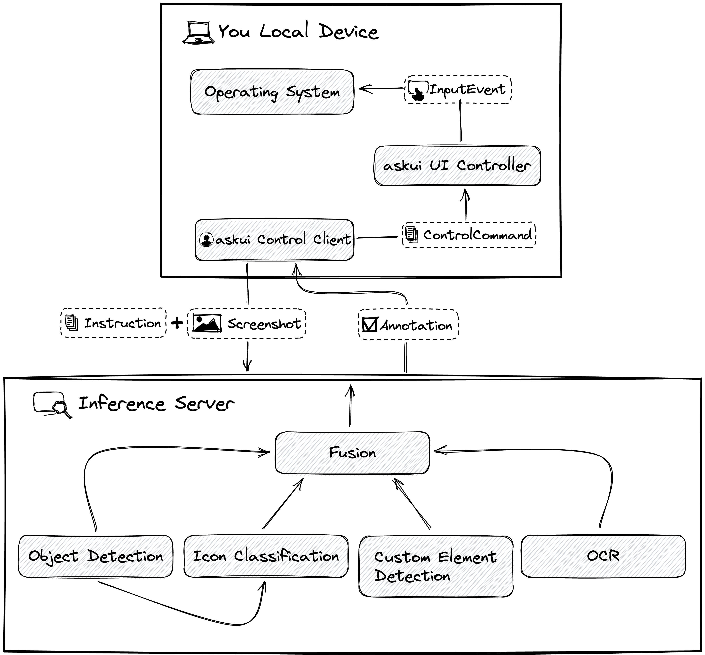
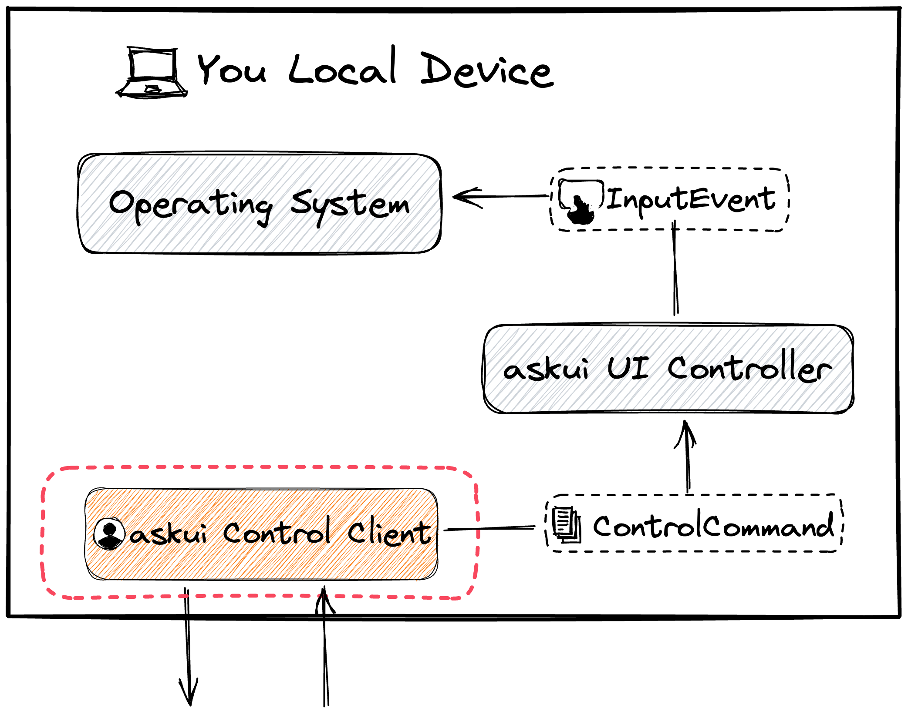
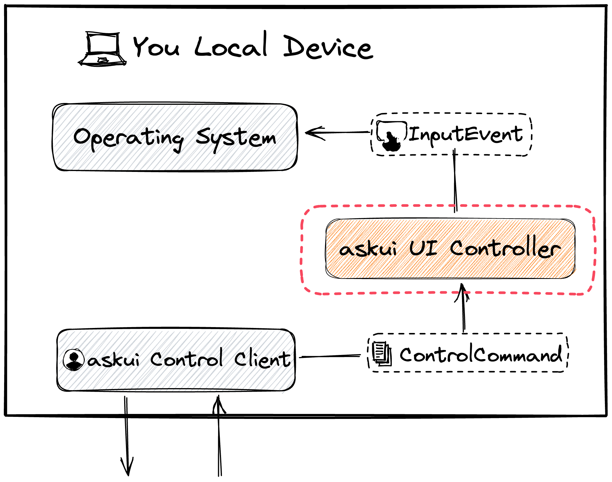
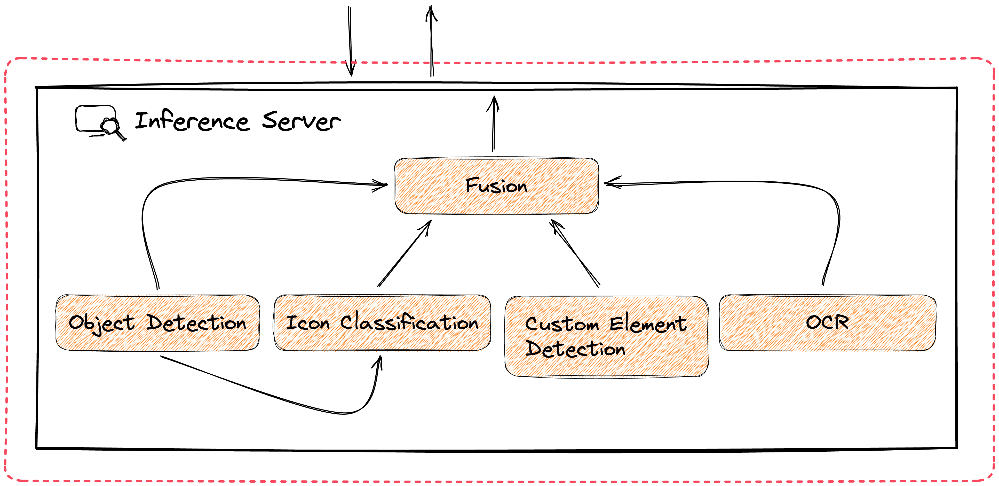

# How askui Works

## Overview

In this article, we will give a detailed overview of askui`s architecture and how it works under the hood.




askui is built on top of a number of components. We will cover what these components are and how they work together to provide a flexible and reliable way to automate interactions with UI elements of any operating system or platform.

By the end of this article, whether you're a software developer, QA engineer, or automation specialist, you'll have a solid understanding of how askui works, and be able to use this knowledge to build more efficient automation for your project.


askui consists of three building blocks:

- askui Control Client
- askui UI Controller
- askui Inference Server

We will step through each of them and see how they work together to perform UI automation.

------
## Glossary

Throughout this article, we will use some terms that describe certain parts of askui. Some of them are used only internally and not exposed by the askui Control Client API, but are important for understanding how askui works and what it can do. Please refer to this table while reading.

| **Term**        | **Description** |
| --------------- | --------------- |
| *Element-description*    | A description for a UI element. In the askui Control Client API, for example, it is the coded description like `button()` or `textfield().contains().text().withText('Email')`. |
| *Action*       | A method in the askui Control Client API that describes an action to be taken against the operating system. For example `click()`, `type()`. |
| *InputEvent* (internal) | A specific type of action to be taken against the operating system. For example *MouseInputEvent* or *KeyboardInputEvent*. |
| *ControlCommand* (internal) | A command sent to the UI controller telling what to perform on the operating system. It consists of one or more *InputEvents*. |

------

## askui Control Client



The **askui Control Client** provides the API that tells askui what/how to automate. Once you start using askui, you will mostly interact with askui via the **askui Control Client**. In most of our tutorials and demonstrations, you will see `let aui: UIControlClient` is declared and combined with an *Action* and *Element-descriptions* which ends up forming an instruction, e.g:

```ts
await aui.click().button().withText('login').exec();
```

- As shown above, you form an instruction by chaining an *Action* with *Element-descriptions* using the Fluent API of the **askui Control Client**. It is designed as a **[fluent interface](https://en.wikipedia.org/wiki/Fluent_interface)** to increase readability and make it more understandable.

- The **askui Control Client** sends a request to the **askui UI Controller**:
    - to take a screenshot.
    - with a *ControlCommand* that tells what *InputEvent* to perform on the operating system.

- The **askui Control Client** communicates with the **askui Inference Server**:
    - to send a screenshot to be annotated with the instruction.
    - to receive the annotation, e.g. detected elements.


To use the **askui Control Client**, user credentials are required. User credentials can be obtained via our [User Portal](https://app.v2.askui.com/).

See our [API documentation](https://docs.askui.com/docs/api/Configuration/askui-ui-control-client) for more information on this component.

------

## askui UI Controller




The **askui UI Controller** is a binary that controls the operating system. This binary gets automatically downloaded when the `UiController` is initialized by calling `UiController.start()`. Once executed, it stays in the background and communicates with the **askui Control Client** on a specific port to receive the *ControlCommand*. Based on the given *ControlCommand*, it triggers *InputEvents* respectively.

- The **askui UI Controller** is responsible for:
    - Taking a screenshot.
    - Triggering the *InputEvent*, i.e MouseInputEvent, KeyboardInputEvent, or shell execution.
    - Running the [interactive annotation](https://docs.askui.com/docs/general/Tooling/annotation#interactive-annotation).

See our [API documentation](https://docs.askui.com/docs/api/Configuration/askui-ui-controller) for more information on this component.

------

## askui Inference Server




The **askui Inference Server** is responsible for the prediction of UI elements within the given screenshot. As soon as it receives a request from the **askui Control Client**, it performs the prediction on the given image and returns the annotation to the **askui Control Client**. 

For the inference, we use a machine-learning model that consists of several submodels:
- **Object Detector**: Detects UI elements (e.g button, textfield).
- **Icon Classifier**: Predicts the class of an icon based on the detected objects (e.g. a user icon 👤).
- **Optical Character Recognition (OCR)**: Converts the image of a text into text.
- **Custom Element Detector**: Searches for an area in the given screenshot that matches the image given by the *Element-description* `.customElement()`.

------

## Them All in Action

Assuming that we run askui on the same device we want to automate, the simplest synopsis can be described as such:


When running askui, 
1. The **askui Control Client** checks whether it is needed to be processed by the **Inference Server**.

2. If the code **contains any of the [Element-description](../../api/01-API/table-of-contents.md#element-descriptions) or [Getters](../../api/01-API/table-of-contents.md#getters)**, then the **askui Control Client** tells the **askui UI Controller** to take a screenshot of the given screen and sends it to the **Inference Server**. 

3. After the **askui Control Client** has retrieved the annotation back from the server, it sends a *ControlCommand* to the **askui UI Controller**. Afterwards, the **askui UI Controller** triggers the *InputEvent* on the operating system.

    ```ts
    // an example of askui code containing an element-identifier
    await aui.click().button().withText('Confirm').exec();
    // Here, the filter 'button()' is used together,
    // so the client will fire a request to the server.
    ```

4. If the code **contains an [Action](../../api/01-API/table-of-contents.md#actions) but no Element-description**, then the **askui Control Client** sends the *ControlCommand* to the **askui UI Controller** to trigger the *InputEvent* directly.

    ```ts
    // an example of askui code containing only a command
    await aui.pressThreeKeys('control','alt','del').exec();
    // It uses only a command 'pressThreeKeys()',
    // so it will be executed by the UI Controller directly.
    ```

- An **Element-description** represents a specific type of UI element that can be recognized by inference. Most of the commonly used UI elements such as *button*, *textfield* are supported and can be used.

- An **Action** represents a specific type of action to be performed, i.e *Mouse/Keyboard Input Event* or *Shell Command*. This action can be performed on a specific element when combined with **Element-descriptions** or can be performed on its own as shown in the example right above.

Please visit our [API Docs](../../api/01-API/table-of-contents.md), if you want to learn more about different types of *Element-description* and *Action*.

------

## Conclusion

Here we have seen the three core components of askui. If you aim to use askui in a more advanced way, e.g. integrating it into your CI/CD pipeline, it may be worthwhile to get an overview of how it is composed. For more practical examples, please refer to our [Tutorials](../06-Tutorials/index.mdx) and [API docs](../../api/01-API/table-of-contents.md). And don't forget to come over to our [Discord community](https://discord.gg/Gu35zMGxbx), if you have any questions about askui!