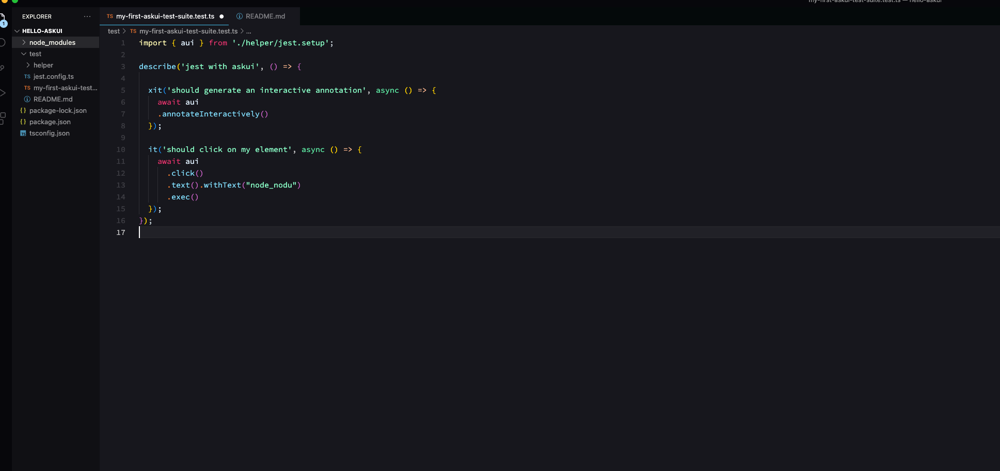
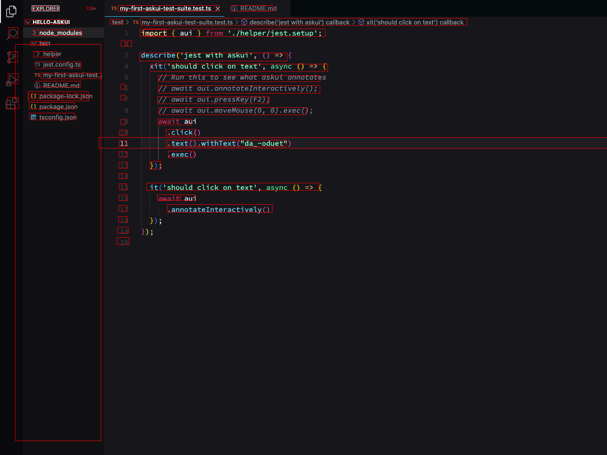

# Annotation

## Interactive Annotation
An interactive annotation is in essence three components:

1. A screenshot of whatever the askui controller is told to see, as defined in the config file:



2. Annotations, or the red boxes you see, which are added by the machine learning model.



3. Filters, which are labels applied to the annotations of the screenshot.

Clicking an element will copy this filter, which we can then use in the [step 3 of Getting Started page](../02-Getting%20Started/getting-started.md), which is actually using that to execute commands.


## Static Annotation

The helper function `annotate()` creates an annotated HTML file of the given image and saves it into the given path. If no image is given, then it captures the specified screen and annotates the captured image.

<details>
<summary>Synopsis and Arguments</summary>

**Synopsis**
```ts
UiControlClient.annotate();

// or

UiControlClient.annotate({
    imagePath: '<your-image-path>',
    outputPath: '<path-of-the-generated-html>',
    fileNamePrefix: '<prefix-of-the-output-file>',
    customElements: CustomElementJson[] // more details in the example below
});
```

**Arguments**
- If no argument is given, 
    - A screenshot of your specified screen will be taken, and annotated. Thereafter, it will be saved as an interactive HTML file into the `report/` folder.

- `imagePath`:
  - If defined, the image at the path is loaded and annotated.
  - If not defined, a screenshot of your specified screen is taken and annotated.

- `outputPath`:
    - If defined, the generated HTML report will be saved in this path.
    - If not defined, a folder `report/` will be created in the project root.

- `fileNamePrefix`: The prefix for the resulting HTML report. 

- `customElements`: A *list* of custom elements. The AI model will use them to detect elements similar to them.

</details>


**Example**

```ts
/*
Takes a screenshot of your selected display,
and produces an HTML report file inside the
default output path <project_root>/report.
*/
await aui.annotate();


/*
Loads the image 'my-screenshot.png'
and produces an HTML report file inside
the output path 'annotation-reports/'
*/
await aui.annotate(
    {
    imagePath: 'my-screenshot.png',
    outputPath: 'annotation-reports/'
    });


/*
Loads the image 'my-screenshot.png' together with
the custom elements and produces an HTML report file
inside the output path 'annotation-reports/'
*/
await aui.annotate(
    {
    imagePath: 'my-screenshot.png',
    outputPath: 'annotaion-reports/',
    customElements: [
        {
        customImage: '<custom_image_path|base64Image>',
        imageCompareFormat: 'grayscale',
        name: 'custom element 1'
        },
        {
        /*
        for this custom element the OCR AI model
        will be used to extract text from the image,
        since no name was given.
        */
        customImage: '<custom_image2_path|base64Image>',
        imageCompareFormat: 'RGB',
        }
    ]
    });
```
