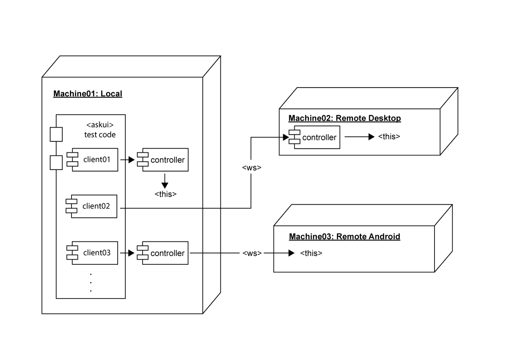
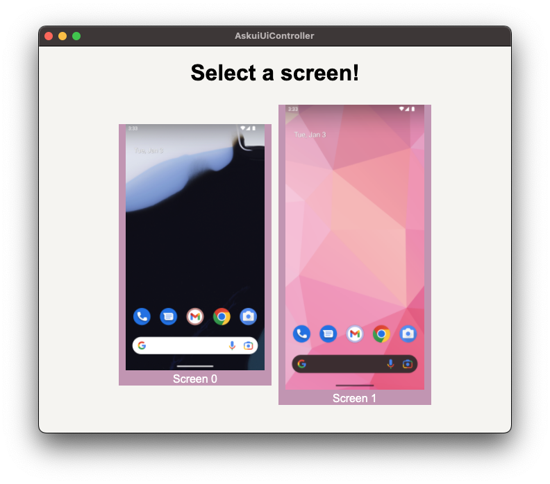

# Automate Multiple Devices

This tutorial shows how to automate multiple devices on the same network by using askui. After following this tutorial, you will be able to automate more than one device across different platforms, whether Linux, macOS, Windows or Android, with a single setup with askui library.

In fact, there are many automation tools in the wild that you can use to automate different devices, although most of them require different configurations and different code for different platforms. By using askui library, an automation tool that operates on the OS level, you can use the same code for any application running on different devices even without so much change. And this makes askui a powerful Cross-platform automation tool. 

Let's have a look at the askui library and see how we can accomplish a Cross-platform/-device automation test🔥


📌 *The following tutorial assumes that you have already installed and set up the askui library on your local device. The code for the configuration is based on the generated code: `npx askui init`. See [Getting Started](../02-Getting%20Started/write-your-first-instruction.md) for more details.*



## 1. Download and Prepare the `askui-ui-controller` Binary for Each Device

- If you already used the askui library once, then the binary for your platform already exists in the `node_modules/` directory, as the binary gets automatically downloaded when an instance of `UiController` gets initialized. [See here](../../api/08-Configuration/askui-ui-controller.md) for more details on the *askui UI Controller*.

- Follow this path and confirm that the binary exists:

    ```bash
    # Windows
    node_modules/askui/dist/release/latest/win32/askui-ui-controller.exe

    # macOS
    node_modules/askui/dist/release/latest/darwin/askui-ui-controller.app/Contents/MacOS/askui-ui-controller

    # Linux
    node_modules/askui/dist/release/latest/linux/askui-ui-controller.AppImage
    ```

- If the remote device runs the same OS as the local device, copy the binary from the local device to the remote device.
- If the remote device runs a different OS, then download the binary for the respective platform:
    - [Windows](https://askui-public.s3.eu-central-1.amazonaws.com/releases/askui-ui-controller/latest/win32/x64/askui-ui-controller.exe) | [macOS(intel)](https://askui-public.s3.eu-central-1.amazonaws.com/releases/askui-ui-controller/latest/darwin/x64/askui-ui-controller.dmg) | [macOS(silicon)](https://askui-public.s3.eu-central-1.amazonaws.com/releases/askui-ui-controller/latest/darwin/arm64/askui-ui-controller.dmg) | [Linux](https://askui-public.s3.eu-central-1.amazonaws.com/releases/askui-ui-controller/latest/linux/x64/askui-ui-controller.AppImage)
- If the remote devices runs Android, see the chapter [Android Only](#android-only).


## 2. Run the Controller on Each Device

- This controller will trigger mouse/keyboard events on this local device.
- On your local device, go to your project's root and run the *askui UI Controller* with the command below:
    ```bash
    # Windows powershell or cmd
    node_modules/askui/dist/release/latest/win32/askui-ui-controller.exe --host 0.0.0.0 -d 0 -m

    # macOS
    node_modules/askui/dist/release/latest/darwin/askui-ui-controller.app/Contents/MacOS/askui-ui-controller --host 0.0.0.0 -d 0 -m

    # Linux 
    node_modules/askui/dist/release/latest/linux/askui-ui-controller.AppImage --host 0.0.0.0 -d 0 -m
    ```


- If running successfully, you should see the logs printed on the terminal, e.g:
    ```bash
    [2023-01-02 17:31:19.634 +0100] DEBUG (AskuiUiController): Window is minimized.
    [2023-01-02 17:31:19.639 +0100] INFO (AskuiUiController): Selecting display number 0.
    [2023-01-02 17:31:19.641 +0100] INFO (AskuiUiController): Successfully started.
    ```

- Next, we run another *askui UI Controller* that will run on the remote device and will trigger mouse/keyboard events on the remote device.
- On your remote device, go to where you have saved the *askui UI Controller* and run it with the command below:

    ```bash
    # Windows powershell or cmd
    /askui-ui-controller.exe --host 0.0.0.0 -d 0 -m

    # macOS
    askui-ui-controller --host 0.0.0.0 -d 0 -m

    # Linux 
    askui-ui-controller.AppImage --host 0.0.0.0 -d 0 -m
    ```


### Android Only:

- If you don't have the `adb` installed on your local device, set it up by following [this tutorial](setup-android.md).
- If your remote device is an Android device, run the *askui UI Controller* on the **local device (desktop)** with an extra option as below:

    ```bash
    # Windows powershell or cmd
    askui-ui-controller.exe --host 0.0.0.0 -d 0 -r android

    # macOS
    askui-ui-controller --host 0.0.0.0 -d 0 -r android
    ```

- Make sure that your local device (desktop) is running **TWO DIFFERENT `askui-ui-controller`**, if you want to control the local device and the Android device at the same time.

#### (optional) Running Multiple Android Devices
- Run the commands below on the local device, to which your Android devices are connected.
- The *askui UI Controller* considers all Android devices as a single device with multiple displays. See the screenshot below.
- Set the `-d 0` option differently for each Android device.

    ```bash
    # Windows
    # For the first Android device
    askui-ui-controller.exe --host 0.0.0.0 -d 0 -r android
    # For the second Android device
    askui-ui-controller.exe --host 0.0.0.0 -d 1 -r android

    # macOS
    # For the first Android device
    askui-ui-controller --host 0.0.0.0 -d 0 -r android
    # For the second Android device
    askui-ui-controller --host 0.0.0.0 -d 1 -r android
    ```




#### (optional) Connecting the Android Device Wireless via adb

- In case you  want to connect the Android device wirelessly, follow the commands below:

    ```bash
    # Make sure that the `USB Debugging Mode` is enabled in the Android device.
    # Connect the Android device with a USB cable, and run this command:

    adb devices # will print the <device-id>

    adb -s <device-id> tcpip 9000 # replace <device-id> with your device-id

    adb -s <device-id> connect <local-ip-address>:9000 # replace the <local-ip-address>

    # Run this command, if you want to check the local ip address of the android device
    adb -s <device-id> shell ip -f inet addr show wlan0

    # Now you can disconnect the USB cable from the Android device.
    # Confirm that the Android device is recognised by adb wirelessly.
    adb devices
    ```


## 3. Configure the `jest.setup.ts`

- Figure out the local IP address of the remote device, and then change the `<local-ip-address>` of the `jest.setup.ts`:
    ```ts
    import { UiControlClient, UiController } from 'askui';

    let localDevice: UiControlClient;
    let remoteDevice: UiControlClient;

    jest.setTimeout(60 * 1000 * 60);

    beforeAll(async () => {

        // Get your askui credentials from https://app.v2.askui.com/
    const credentials = {
        workspaceId: '<your-workspace-id>',
        token: '<your-token>',
    }

        // This client will communicate with
        // the controller running on this local device.
    localDevice = await UiControlClient.build({ 
        uiControllerUrl: "ws://127.0.0.1:6769",
        credentials: credentials,
    });

    await localDevice.connect();

        // This client will communicate with
        // the controller running on the remote device.
        // Replace the <local-ip-address>
        // In case of Android device, replace it with 127.0.0.1
    remoteDevice = await UiControlClient.build({    
        uiControllerUrl: "ws://<local-ip-address>:6769", 
        credentials: credentials,
    });

    await remoteDevice.connect();
    });

    afterAll(async () => {
    localDevice.close();
    remoteDevice.close();
    });

    export { localDevice, remoteDevice };
    ```


## 4. Write the askui Code

- Write the askui code in `test/my-first-askui-test-suite.test.ts`:
    ```ts
    import { localDevice, remoteDevice } from './helper/jest.setup';

    describe('jest with askui', () => {
        it('should work with multiple devices', async () => {
            const everyElement_remote = await remoteDevice.getAll().exec();
            console.log(everyElement_remote);

            await localDevice.moveMouse(500,500).exec();
            const everyElement_local = await localDevice.getAll().exec();
            console.log(everyElement_local);
        });
    });
    ```

## 5. Run the Code

- Run the command below to run the askui code:
    ```bash
    npx jest test/my-first-askui-test-suite.test.ts --config ./test/jest.config.ts
    ```


## 6. Conclusion
Now you should be able to automate multiple devices in the network. If you got any issues while following this tutorial, don't hesitate to ask our [Discord Community](https://bit.ly/3T2je6C)!