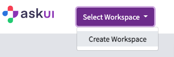

# Access Token
On the askui User Portal dashboard click _Select Workspace_ and then _Create Workspace_

Make sure to enter a meaningful name in the next popup.

With the workspace created you can now create access tokens for it. Click on the menu item _Tokens_ and then click _New Access token_

Enter the token name and an expiry date and click _create_.

The next popup will show your access token and your workspace ID. Both act as credentials for using our service. Make sure to save your access token somewhere save. It is the only time you can access it!

