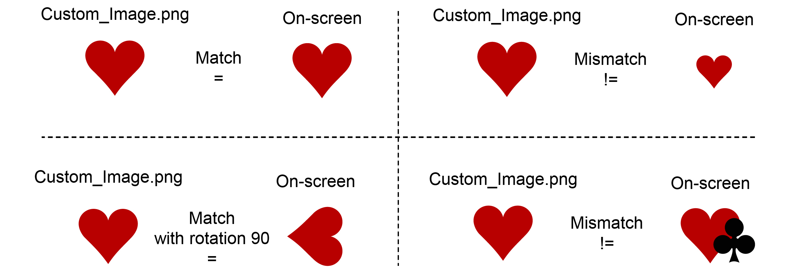
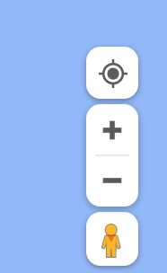

**Index**

[Text Selectors](#text-selectors)

[Element Selectors](#element-selectors)

[Custom Elements](#custom-elements)

[Recommended Practices](#recommended-practices)


## Text Selectors

When using AskUI for automated tests, text elements are playing a big role, since they typically appear more distinctively than other elements such as icons or text fields. Hence, knowing the benefits of using different text element-description can become critical in scaffolding a robust set of instructions.

AskUI provides four different element-descriptions to handle text elements:

- `containsText()`
- `withExactText()`
- `withText()`
- `withTextRegex()`

For a convenient demonstration, we will use a [Flutter web demo](https://gallery.flutter.dev/#/demo) provided by Flutter. 

------

### Basic Text Matching

The simplest way to interact with a text element is to use `withText()`. Go to the demo app page and run the code below:

```ts
await aui.moveMouseTo().text('matrial').exec();
await aui.mouseLeftClick().exec();
```


`withText()` tries to find a text that matches the whole sequence. In most cases, you will want to stick to this method, as it supports **Fuzzy Matching** and tolerates misspelled text. **Note that the above example code has two typos**. `matrial` doesn't match the text in the demo app, which is `Material`, although AskUI will find the text element that roughly matches the text on the screen.

------

### Match a Sub-string within a Text

Even though the `withText()` is handy and quite reliable, you might face a case where you know only a fraction of the text element that you want to interact with. In such a case, `containsText()` is the element-description you might want to use:

```ts
await aui.moveMouseTo().text().containsText('Bottom').exec();
await aui.mouseLeftClick().exec();
```


Be aware that even if the `containsText()` also supports **Fuzzy Matching**, it won't match the whole sequence by just a few characters. Try to use this code with the given demo app:

```ts
// this will fail
await aui.moveMouseTo().text().containsText('Bottm').exec(); 
```

You will notice that AskUI fails to match the given text `Bottm`, whereas this code will work:

```ts
// this will succeed
await aui.moveMouseTo().text().containsText('Bottm appbar').exec();

// this will also succeed
await aui.moveMouseTo().text().containsText('Bottom').exec(); 
```

The biggest difference between `withText()` and `containsText()` is whether it matches the text as a whole sequence or not. Matching many texts with a repeating affix could be a practical use case for the `containsText()`.

It is recommended to experiment enough with these element-descriptions to find a better option that suits your specific case, since it's not easy to predict if the given text can be fuzzy-matched with target texts.

------

### Match the Exact Text

If you already know what text you are looking for, or if there are too many similar text elements, you can use the element-description `withExactText()`.

From the main page of the demo app, go to `Material`->`Data tables`. You will see a table with different foods given with nutrition factors for each of them.

Let's say that we want to click on the items that has exactly **25.0 gm of Fat**. In our demo app, only the **Doughnut** is the matching item. Run this code and see how `withText()` matches the text:

```ts

// Use this helper function to calculate the centroid of the detected elements.
function getCentroid(element: any): any {
    let x = (element.bndbox.xmax - element.bndbox.xmin) / 2.0 + element.bndbox.xmin;
    let y = (element.bndbox.ymax - element.bndbox.ymin) / 2.0 + element.bndbox.ymin;
    return { x: x, y: y };
}

// Find all the text elements that matches '25.0'
const elts = await aui.get().text('25.0').exec();

// Then, iterate through the found elements and click on them
for(let i=0; i<elts.length; ++i){
    const centroid = getCentroid(elts[i]);
    await aui.moveMouse(Math.round(centroid.x), Math.round(centroid.y)).exec();
    await aui.mouseLeftClick().exec();
}

```


You will see that AskUI clicks not only the **25.0** but also the **26.0**, which is the fat of the **Apple pie**. The result of this test code may differ in your case, because of the different screen resolution and the rendered-size of the demo app.

It will give you a clear idea where you will need to use the element-description `withExactText()` instead of `withText()`. Try to run the same code after replacing the `withText()` to `withExactText()`:

```ts
// Find all the text elements that matches '25.0' exactly
const elts = await aui.get().text().withExactText('25.0').exec();

// Then, iterate through the found elements and click on them
for(let i=0; i<elts.length; ++i){
    const centroid = getCentroid(elts[i]);
    await aui.moveMouse(Math.round(centroid.x), Math.round(centroid.y)).exec();
    await aui.mouseLeftClick().exec();
}
```


### Match Text with Regular Expression

The element-description `withTextRegex()` supports **Regular Expression** to match any text in the most flexible way. Although it might be tricky to use regex due to its esoteric appearance, it is maybe one of the most versatile solutions when it comes to character matching.

On the same page of the demo app, let's say that we want to click on the items whose Calorie is between 300 and 500 `(cal>=300 && cal<500)`. Since regex doesn't support numeric comparison, we will try to match the digits in a sequence:

```ts
// Find all the text that matches the expression
const cals = await aui.get().text().withTextRegex('[3-4][0-9]{2}').exec();

// Then, iterate through the found elements and click on them
for(let i=0; i<cals.length; ++i){
    const coord = getCentroid(cals[i]);
    console.log(cals[i].text, coord);
    await aui.moveMouse(Math.round(coord.x), Math.round(coord.y)).exec();
    await aui.mouseLeftClick().exec();
}
```


The regular expression `[3-4][0-9]{2}` means,
- **[3-4]**: Match one character between 3 and 4.
- **[0-9]**: Match one character between 0 and 9.
- **{2}**: Repeat the previous expression ([0-9]) two times.

As the result, it will try to match every text that has a sequence starting with the digit 3 or 4, and then has any two digits in a row.


## Element Selectors

:::caution

This page is currently under construction. If you have any questions, please feel free to reach out to info@AskUI.com or book a meeting with Jonas https://calendly.com/jonas-menesklou/asui

:::


## Custom Elements

:::caution

**Important**: This increases the runtime quite a bit. So use it only if absolutely necessary.

:::

### Overview

**Custom Element Selection** is a feature in AskUI that enables you to create custom element-descriptions for elements on the screen, instead of relying on the standard element-descriptions provided such as **Button**, **Textfield**, etc.

With this feature, you can define a custom element-description based on how the element is displayed on the screen. This can be particularly useful in situations where standard element-descriptions are unreliable due to the non-standard properties of the element. It provides greater flexibility and control, allowing you to tailor the automation to meet the specific needs of your application.

Here we will demonstrate how to use a custom element to explore Google Street View.

### Demonstration

<video controls>
  <source src="https://d2dnep8p8ldagm.cloudfront.net/assets/docs/blog_customElement_AskUI_google_street_view.mp4"/>
</video>

### Requirements

- **AskUI** - Follow [this tutorial](https://docs.AskUI.com/docs/general/Getting-Started/getting-started) if you haven't installed it yet.
- **Web Browser** - We use Safari in this demonstration, but you can use any web browser you have.

### Understanding the `customElement()` in AskUI

- `customElement()` is an element to look for on the screen that is defined by the user with a given image.

```ts
// Example of customElement()

await aui
    .click()
    .customElement({
        customImage: './logo.png', // required
        name: 'myLogo', // optional
        threshold: 0.9, // optional, defaults to 0.9
        rotationDegreePerStep: 0, // optional, defaults to 0
        imageCompareFormat: 'grayscale', // optional, defaults to 'grayscale'
    })
    .exec();
```

#### Arguments

- **customImage** (*`string`, required*):
    - A cropped image in the form of a base64 string or file path.
- **name** (*`string`, optional*):
    - A unique name that can be used for filtering for the custom element. If not given, any text inside the custom image will be detected via OCR.
- **threshold** (*`number`, optional*):
    - A threshold for how much a UI element needs to be similar to the custom element as defined. Takes values between `0.0` (== all elements are recognized as the custom element which is probably not what you want) and `1.0` (== elements need to look exactly like the `customImage` which is unlikely to be achieved as even minor differences count). Defaults to `0.9`.
- **rotationDegreePerStep** (*`number`, optional*):
    - Step size in rotation degree. Rotates the custom image by this step size until 360° is exceeded. The range is from `0` to `360`. Defaults to `0`.
- **imageCompareFormat** (*`'RGB' | 'grayscale'`, optional*):
    - The color compare style. `grayscale` compares the brightness of each pixel whereas `RGB` compares all three color. Defaults to `grayscale`.


#### Two Things to be Aware of When Using `customElement()`

**1) Create the Custom Image by Cropping it From The Actual Screen**

- To find a matching element from the screen, the custom image **must be the same as it is displayed on the screen.** By saying *same* in this sense, includes the **size, rotation as well as the overlapping object,** if there is any. 



- Note the **left-bottom case** of the illustration. A rotated element can be also matched, but **only if** everything else except the rotation are staying the same as it is displayed on the screen. If you can assure that your custom image is exactly the same as it is displayed on the screen + if you know the degree of the rotation, then you could consider using the **rotationDegreePerStep** parameter. And because AskUI will try to rotate the custom element for the whole revolution, a divisor of the rotated degree could be also used, e.g in the illustrated case, we can use not only `90` but also `45`, `30`, `15`, etc. But since smaller degrees will require more iteration steps, it will increase the runtime by a notable amount.

- **The simplest way** to accomplish it might be **to screen capture and crop the desired image from your screen directly.** In Windows and macOS, you can use the built-in screen capture tool:

    - Windows: Press `windows` + `shift` + `s` (Windows 10 or higher)
    - macOS: Press `cmd` + `shift` + `4`

- In both cases, you will be asked to select a certain portion of the screen. On Windows, the captured image will be stored in the clipboard, so you will need to save it to an image file. On macOS, the image will be saved in the `~/Desktop` by default.

:::tip
The quality of the __crop-out__ determines how good the element will be recognized. Make sure to:

* Save it as a __PNG__ to avoid artifacts from compression
* Crop it out as tight as possible. At best with no pixel space on the borders.
:::

**2) The Time of the Execution will Increase by a Notable Amount**

- To examine whether the custom image matches the given screen, AskUI iterates through the whole pixels of the given screen as well as the custom image. So it is likely to increase the runtime by a notable amount. Therefore, if the task could be accomplished with other element-descriptions such as `icon()`, `button()`, or `text()`, then it's maybe better to avoid using the `customElement()`.


### Capture the Custom Element

- In this demonstration, we will search for a certain area in **Google Street View**. This can be enabled by pressing a button **at the right corner of the [Google Maps](https://maps.google.com)**:



- Can you see the yellow tiny human in the corner? We need an image of this human figure to interact with it.

- Let's make a screen capture of it. It shall look like this:


- Then save the image in your project's root directory with the name `human-figure.png`. The file tree of your project's root directory will be like this:
```bash
project_root/
├─ node_modules/
├─ test/
├─ package.json
├─ tsconfig.json
├─ human-figure.png
```

### Write the AskUI Code

- If you are prepared with the image above, let's jump into our code:

```ts
import { aui } from './helper/jest.setup';

describe('Explore the world in google maps', ()=>{

  it('open web browser and go to  google maps', async ()=>{

    // open the start menu/spotlight to search for the web browser
    await aui.pressTwoKeys('command', 'space').exec(); // for macOS
    // await aui.pressKey('command').exec(); // for Windows
    await aui.waitFor(250).exec(); // wait for the start menu to open

    await aui.type('safari').exec(); // type the name of the web browser
    // await aui.type('chrome').exec(); // if you are using another web browser, replace the name to it
    await aui.pressKey('enter').exec(); // open the web browser
    await aui.waitFor(1000).exec(); // wait for the web browser to open

    await aui.type('https://maps.google.com').exec(); // type the url of the website
    await aui.pressKey('enter').exec(); // open the website
    await aui.waitFor(1000).exec(); // wait for the website to load

  });

  it('search for a location', async ()=>{
    
    await aui.type('machu picchu').exec(); // type the name of the location
    await aui.pressKey('enter').exec(); // search for the location
    await aui.waitFor(2000).exec(); // wait for the map to load
    await aui.pressKey(',').exec(); // hide the side panel

  });

  it('enable street view', async ()=>{

    // now we look for our custom element on the map
    // move the mouse to the custom element
    await aui.moveMouseTo()
        .customElement({
            customImage: "./human-figure.png",
            name: "street-view-icon",
            threshold: 0.9,
        })
        .exec();

    // click and hold on the custom element
    await aui.mouseToggleDown().exec();

    // drag the custom element(our human) to the location we want to explore
    // note the offset of -50 pixels along the y axis
    // we drag the human 10 pixels higher than the location Aguas Calientes
    await aui.moveMouseRelativelyTo(0, -10).text('Aguas Calientes').exec();

    // release the mouse button
    await aui.mouseToggleUp().exec();
  });
});  
```

- After successfully running the code, you will be able to see the landscape of **Machu Picchu**, the most iconic citadel of the lost empire Inca.

- It is possible that you end up with a plain **Google Map** without having the **Street View** enabled. It might be caused by various reasons, but the most likely scenario is due to the different resolutions of the screen (your display can have a different resolution than mine). You could try to **adjust the amount of the pixel offset** that is given to the `moveMouseRelativelyTo()`, for example, try with `moveMouseRelativelyTo(-5, -15)`.

### Breaking Down the Code

#### 1) Open the Web Browser and Go To the Desired Website

- One notable part of this step is the `waitFor()` after each execution. We have used it in three different lines of this code block. Check out the respective parts and adjust the amount of time to wait until the process is finished. It may take more or less time depending on the condition of your device and internet connection:
```ts
it('open web browser and go to  google maps', async ()=>{
    // open the start menu/spotlight to search for the web browser
    await aui.pressTwoKeys('command', 'space').exec(); // for macOS
    // await aui.pressKey('command').exec(); // for Windows
    await aui.waitFor(250).exec(); // wait for the start menu to open

    await aui.type('safari').exec(); // type the name of the web browser
    await aui.pressKey('enter').exec(); // open the web browser
    await aui.waitFor(1000).exec(); // wait for the web browser to open

    await aui.type('https://maps.google.com').exec(); // type the url of the website
    await aui.pressKey('enter').exec(); // open the website
    await aui.waitFor(1000).exec(); // wait for the website to load
});
```

- Also, don't forget to change the key to press and the name of the web browser based on your condition.

#### 2) Search for the Location

- Here we type our desired keyword into the textfield of Google Maps. As the textfield gets focused automatically, we can directly type in the keyword to the textfield:

```ts
it('search for a location', async ()=>{

    await aui.type('machu picchu').exec(); // type the name of the location
    await aui.pressKey('enter').exec(); // search for the location
    await aui.waitFor(2000).exec(); // wait for the map to load
    await aui.pressKey(',').exec(); // hide the side panel

});
  ```

- Note that we also press the `,`(comma) key to hide the side panel of Google Maps. This is for hiding unnecessary information from the screen.

### Drag the Human Icon to the Desired Location

- Finally, we drag our human, which we defined as our **Custom Element**, to the desired location.
- Firstly, we move the mouse cursor to our custom element.
- For dragging the mouse, we use the `mouseToggleDown()` to **press-and-hold** the mouse left button.
- After that, we move the mouse to the desired location.
- Thereafter, we use `mouseToggleUp()` to **release** the mouse button.

```ts
it('enable street view', async ()=>{

    // now we look for our custom element on the map
    // move the mouse to the custom element
    await aui.moveMouseTo()
        .customElement({
            customImage: "./human-figure.png",
            name: "maps",
            threshold: 0.9,
        })
        .exec();

    // click and hold on the custom element
    await aui.mouseToggleDown().exec();

    // drag the custom element(our human) to the location we want to explore
    // note the offset of -10 pixels in the y axis
    // we drag the human to 10 pixels higher than the location Aguas Calientes
    await aui.moveMouseRelativelyTo(0,-10).text('Aguas Calientes').exec();

    // release the mouse button
    await aui.mouseToggleUp().exec();
});
```
- Note the optional parameters for the `customElement()`, especially the `threshold` that is set to `0.9`.
- This parameter can be set from `0.0` up to `1.0`.
    - `0.0` will consider every element on the screen as matched with the given image.
    - `1.0` will examine the given elements as strict as possible, so you might end up without any matching element found.
- So, the best scenario to set the `threshold` might be:
    - 1) Make the custom image to be as precise as possible (cropping from the screen).
    - 2) Keep the `threshold` relatively higher, but below `1.0`

### Conclusion
If you plan to program an automation where you have elements with non-standard properties, you might want to consider using the custom element feature of AskUI. But as mentioned above, keep in mind that, as a trade-off, it consumes more time than other features. Taking it into account, using a custom element to interact with the given UI can be a huge help, especially if the element lacks standard properties such as tag or appearance. 

If you got any issues while following this article, don't hesitate to ask for help in our [Discord Community!](https://discord.gg/Gu35zMGxbx) We are more than glad to hear about your experience and help!

## Recommended Practices

This page will give you examples of how to use AskUI efficiently and effectively. 

### General Considerations on Speed of Inference for Different Element-Descriptions

| Submodel | Tasks   | Speed  |
| -------- | ------- | -------|
| Object Detector | Common elements, e.g. a button or textfield | fast :rocket: |
| Icon Classifier | Predict the class of an icon, e.g., a user icon  | fast :rocket: |
| Optical Character Recognition (OCR) | Recognize text | fast :rocket: |
| Custom Element Detector | Search via an image inside the screen | slow :snail: |

#### Avoid Optical Character Recognition (OCR) on Too Many Element

If you use `containsText()`, `withText()`, `withExactText()` or `withTextRegex()` **OCR** is applied to all elements detected on your screen. This can slow down AskUI. It is more efficient to narrow down the elements first. For example, if you want to click a `button` with a specific text you should select all buttons first.

```javascript
// Do this
await aui.click().button('See here').exec();
await aui.click().text('Sign in').exec();

// And NOT this
await aui.click('See here').exec();
await aui.click('Sign in').exec();
```

#### Avoid Custom Element Detection if Possible

If you use `customElement()` you are doing an image-in-image search. Use this sparingly only for specific custom elements as the execution time is slow!

```javascript
// Do this
await aui.click().button().withText('Login').exec();
await aui.click().text('Overview').exec();

// And NOT this
await aui.click().customElement({
  customImage: '.../login_button.png', 
  name: 'login button',
}).exec();
await aui.click().customElement({
  customImage: '.../text_overview.png', 
  name: 'overview button',
}).exec();
```

### Scrolling
When you use AskUI you can only interact with elements that you can see on your screen. Therefore you have to scroll down/sideways to interact with currently invisible elements.

#### Scrolling on Touch Displays
On touch displays you have to recreate the swipe gesture:

```javascript
// Touch the display with your finger, move finger to the left, release
await aui.mouseToggleDown().exec()
await aui.moveMouseRelatively(-1500, 0).exec()
await aui.mouseToggleUp().exec()
```

#### Scrolling With Mouse Wheel
If you want to scroll with your mouse wheel you can use the `scroll()` action:

```javascript
// Scroll 10 down in y direction<>
await aui.scroll(0, -10).exec()
```

#### Scrolling With Key Press
If you want to scroll with a key press you could use your arrow keys (`up`, `down`, `left`, `right` ) or the `pagedown`-key.

```javascript
// Press down arrow key
await aui.pressKey('down').exec()

// Press up arrow key
await aui.pressKey('up').exec()

// Scroll down a page
await aui.pressKey('pagedown').exec()

// Scroll up a page
await aui.pressKey('pageup').exec()
```

### Wait for an Element to Appear
AskUI implements a conservative retry strategy to wait for an element to appear. But sometimes this is not long enough.
You can wait for an element to appear with the following helper function:

```javascript
// Retry the command 5 times with a
// wait time of 2 seconds between each try
async function waitUntil(AskUICommand: () => Promise<void>, maxTry = 5) {
  try {
    await AskUICommand();
  }
  catch (error) {
    if (maxTry == 0) {
      throw error
    }
    console.log(`Retry predicting command, ${maxTry} tries left`)
    await aui.waitFor(2000).exec();
    await waitUntil(AskUICommand, maxTry - 1)
  }
}

// Wait for the text 'Github' to be displayed
await waitUntil(
  async () => 
    aui.expect().text('Github').exists().exec()
  );
```
