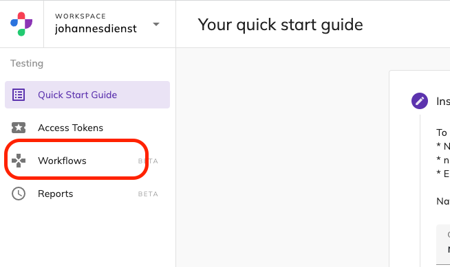
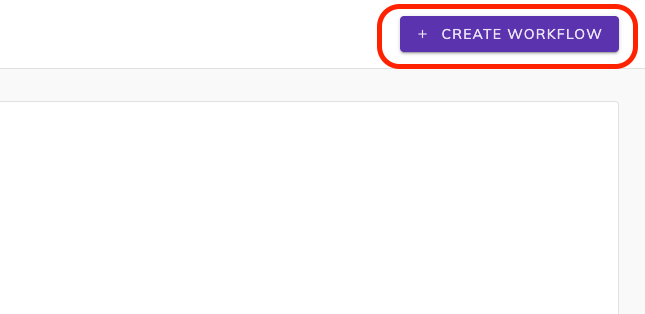
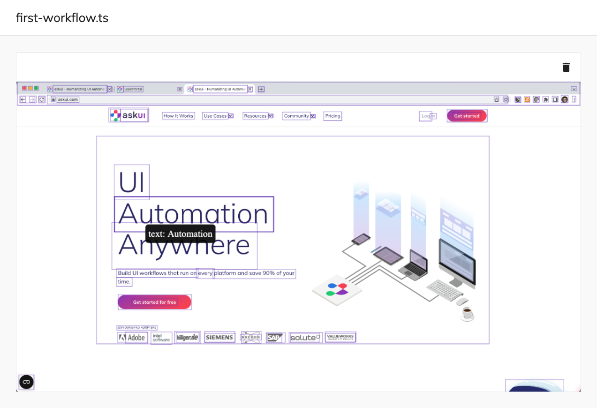
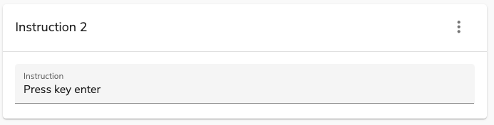
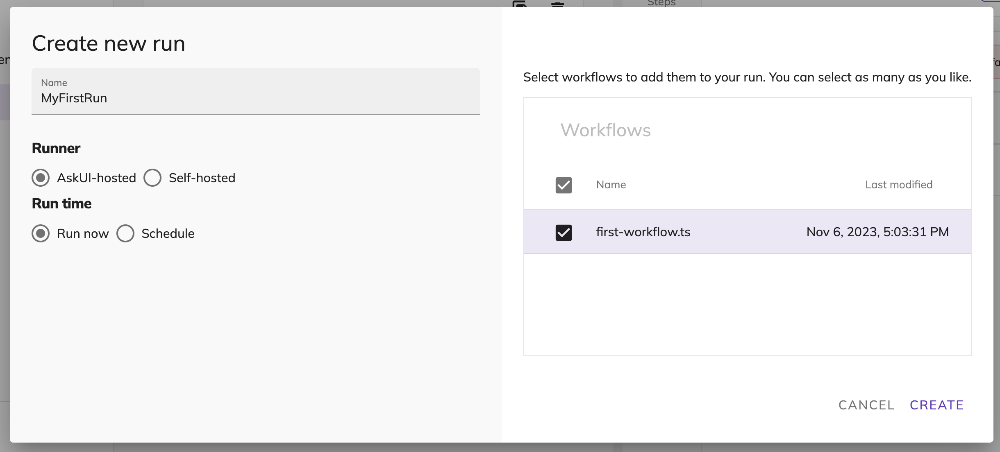
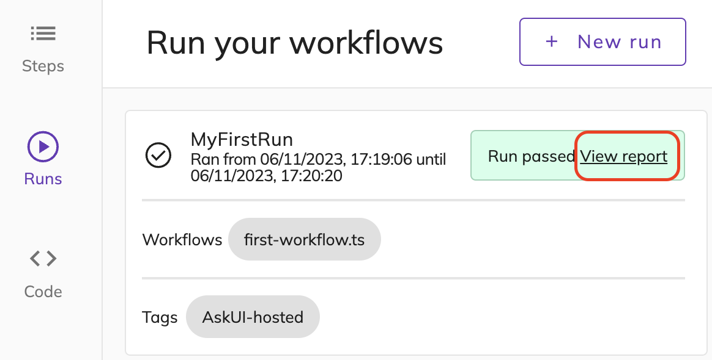
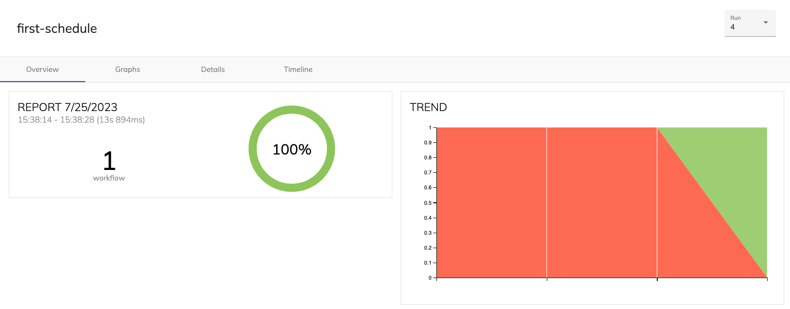

# Start Working with Workflows
This guide will show you how to get started with **AskUI Studio** by guiding you through the creation of a workflow and then running it.

You will learn:

- What a workflow is
- How to create a new one
- How the Workflow Editor is structured
- Design your workflow out of steps
    - General structure
    - How to write instructions
- Schedule/Run your workflow
- View a report of your run

## Workflow and How to Create One

:::info
A **workflow** consists of a number of steps that are ordered sequentially. A workflow run executes all the steps of a workflow.
:::

To create a workflow navigate to the workflow overview page by clicking on the ***Workflow*** menu item on the left.

Then click on **+ CREATE WORKFLOW** in the upper right corner.

Enter a name for your workflow and click **CREATE**.

This will take you to the Workflow Editor.

## Workflow Editor Structure
The **Workflow Editor** can be confusing at first. So let’s make sense of it, shall we?

### Left Side
You can upload a screenshot for each step that gets annotated with bounding boxes that mark the elements found by our inference backend. Once you select a step on the right side.

When you hover over the bounding boxes you see what element type our inference backend detected.

### Right Side

On the right side under **Steps**, you can edit your steps. Each box is one step, with each step containing exactly one instruction.

:::info
A **step** is the basic building block of a workflow. It represents an instruction that is carried out within the graphical user interface of a screen at a specific moment in time.
:::

You can do the following things with a step:

- Simulate once you entered an instruction
- Attach a screenshot that should be annotated (covered in the next section)
- Move up/down
- Delete

## Design Your Workflow
Each step needs an instruction, with which you specify what should happen on the user interface represented by the screenshot you uploaded.

:::info
An **instruction** is a single AskUI directive that usually has the following parts: *action* + (optional) *element-selector*.
:::

<!--alex ignore add-->
When you start out there is no instruction. Add one by clicking the **+ ADD** button.

Click into the textfield **Instruction** to start editing the instruction.

An interaction with a GUI happens through so-called *actions*:

- type
- click
- press key
- move mouse

You can scroll through all the commands from the drop-down box that appears when you focus the *Instruction* textfield.

For example to click the button on the top right with the text **Get started** from the screenshot we showed earlier you can write this. Use the annotations from the screenshot to find out with which elements you can interact:

Click on the little paper plane icon on the right to save your step.

Then click on the three dots of the step and on **Simulate**.

A red dot should appear over the selected element on the left side where your annotated screenshot is.

Congratulations! You selected an element visually and clicked on it with AskUI 🎉.

## Schedule/Run Your Workflow

:::info
When you choose an *AskUI-hosted* runner like in this guide your workflow will start at a browser window and will be limited to what you can do in a browser. Please add an instruction that enters a URL into the browser bar.
:::

If you want to host your own runner in your own environment → [Check out this guide](08-deploy-and-manage-your-own-runners.md)

Your final workflow should look like this:

Once you are finished editing your workflow it is time to schedule the real thing: A **run**.

For this click on the calendar icon named **Runs** located right of the screenshot.

Then click on the button **+ New run** in the right upper corner.

Give the Run a name. Under _Runner_ select **AskUI-hosted** and leave the _Run Time_ property at **Run Now**. Make sure you tick the checkbox for your workflow on the right side. Then click **Create** on the bottom left.

You should see status updates on the right bottom side and also a success message. The status of the scheduled run will be updated dynamically on the right side.

:::info
Your scheduled run gets put in a queue and then executed. It might need a few minutes to finish.
:::

## View Report of Run
Once your workflow run is finished you will get a nice report.

You can click on the **View report**.

Every run will be stored for you, so you can visit them later.

:::info
If you want multiple runs of the same workflow to appear in one report you have to schedule it under the same name. This happens automatically if you schedule a regular run of your workflow.
:::
