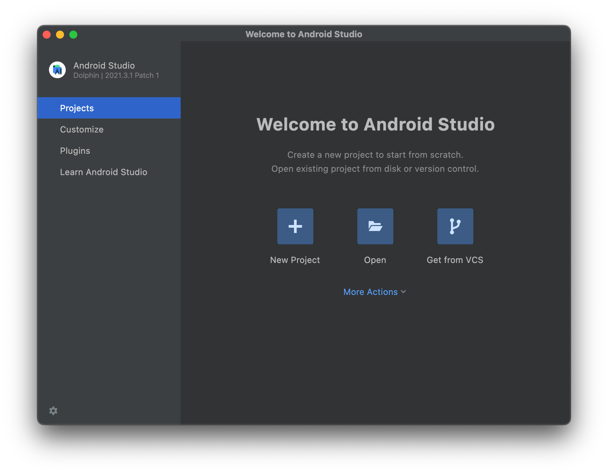
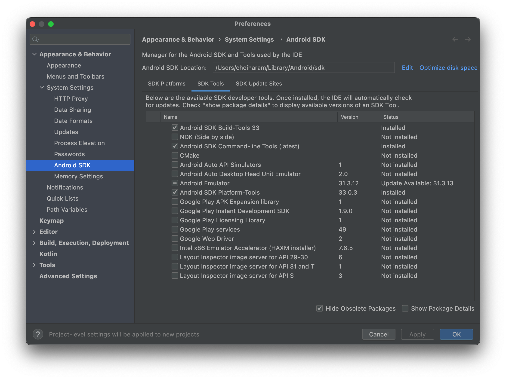
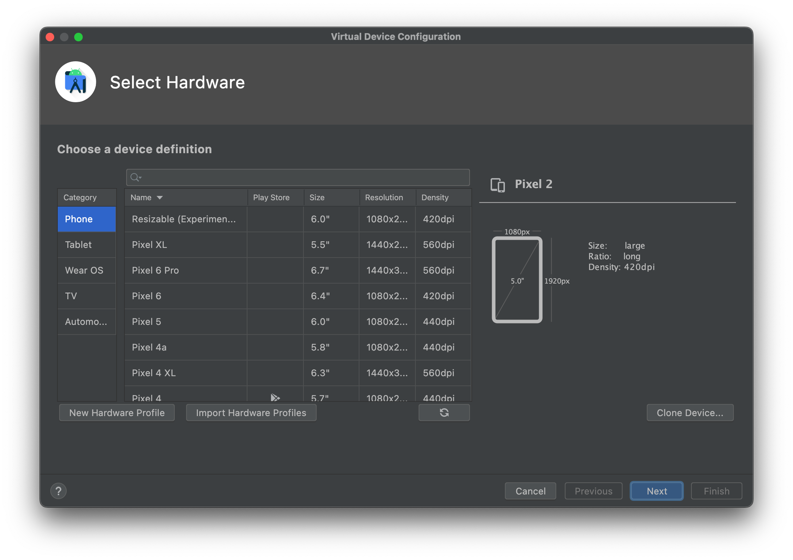
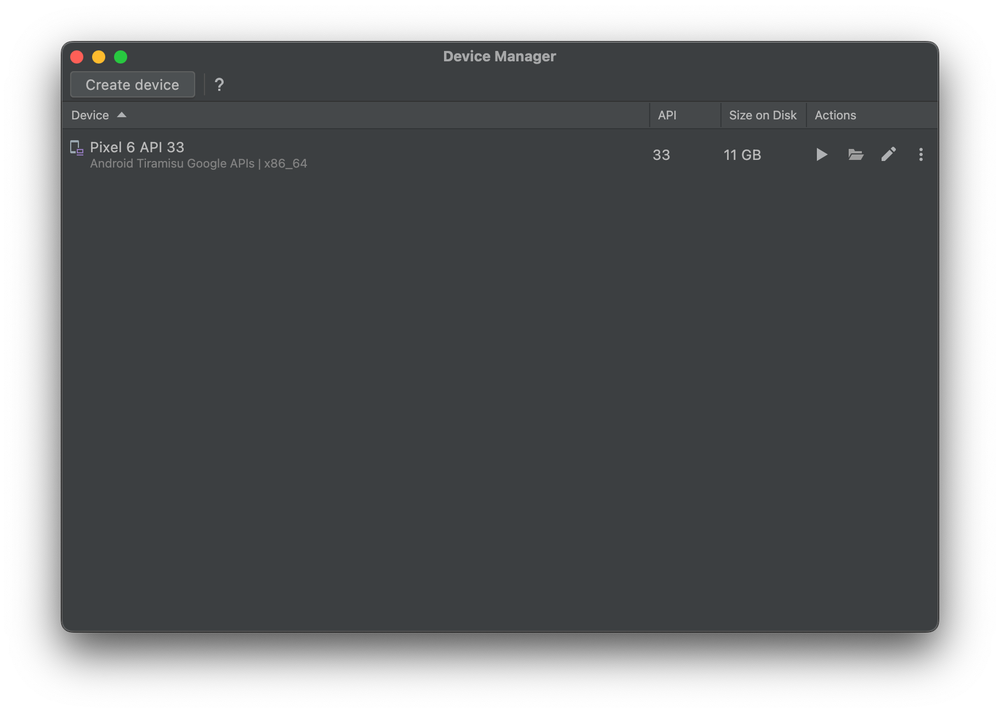

# Setting up Android Devices for Testing Mobile Apps

In this tutorial, we will walk you through how to set up an Android device for developing and testing mobile apps running on Android devices. Depending on the testing environment, i.e. whether it is a real Android device or an emulator, the procedure might slightly differ. But the overall process of the setup will be more or less the same. 

If you want to set up the development environment for Android devices without the Android Studio, then skip the **1. Install Android SDK Command-line Tools** and go to [Set up SDK Command Line Tools without Android Studio](#set-up-sdk-command-line-tools-without-android-studio)

## Requirements
- [Android Studio](https://developer.android.com/studio) installed.
- (optional) Android device, if you want to run your app on a real device


## 1. Install Android SDK Command-line Tools
If you have the Android Studio installed, you have to verify if you have the `Android SDK Command-line Tools` and the `Android SDK Platform-Tools` installed. They both are packages containing several command line tools that are useful for developing apps for Android devices.

To verify the installation of them, 
- Click on the `More Actions` button, and then
- Open the `SDK Manager`




- Then, select `Android SDK` from the list on the left side of the window.
- Go to the `SDK Tools` tab, and check the `Android SDK Command-line Tools` and the `Android SDK Platform-Tools`. After clicking the OK button, it will start to install the tools we have selected.





## 2. Set up the Test Device

After installing the necessary tools in the Android Studio, we can start to set up the Android device that we want to use for the development.

### Set up a Real Android Device
This part is for setting up a real Android device. If you want to use the Android Emulator instead, then you can skip it and go directly to the next step.

To use additional development features in an Android device, we need to enable the `Developer Options` within the device. To enable the `Developer Options`, tap the `Build Number` option 7 times. You can find this option in one of the following locations, depending on your Android version:

- Android 9 (API level 28) and higher: `Settings` > `About Phone` > `Build Number`
- Android 8.0.0 (API level 26) and Android 8.1.0 (API level 26): `Settings` > `System` > `About Phone` > `Build Number`
- Android 7.1 (API level 25) and lower: `Settings` > `About Phone` > `Build Number`

After enabling the `Developer Options`, we can enable the `USB debugging` option. This option will allow the Android Studio and other SDK tools to recognize your Android device via USB. To enable USB debugging, toggle the USB debugging option in the Developer Options menu. You can find this option in one of the following locations, depending on your Android version:

- Android 9 (API level 28) and higher: `Settings` > `System` > `Advanced` > `Developer Options` > `USB debugging`
- Android 8.0.0 (API level 26) and Android 8.1.0 (API level 26): `Settings` > `System` > `Developer Options` > `USB debugging`
- Android 7.1 (API level 25) and lower: `Settings` > `Developer Options` > `USB debugging`

### Set up an Android Emulator

If you want to use the Android Emulator for testing purposes, we have to create a virtual device that runs in the emulator. After running the Android Studio,

- Click on the `More Actions` button, and then
- Open the `Virtual Device Manager`

If no virtual device is created, we can create one by clicking the `Create device` button on the top left corner of the `Virtual Device Manager` window.

You will now see the `Virtual Device Configuration` window. Within the configuration window, you will be asked to:

- Choose a hardware profile
- Choose a system image




The hardware profile represents the specification of the hardware that will be used as a virtual device. Various presets of Android devices e.g. Pixel or Nexus are provided. But you can also create your own hardware profile, after which you will be customizing parameters in such:

- Screen size
- Resolution
- Using Hardware buttons (Back, Home, Menu, Volume, etc.)
- Using On-device sensors (Accelerometer, Gyroscope, GPS)

After choosing a hardware profile, we will be choosing a system image for the Android device. Here we can choose out of a variety of Android images, from the latest Android 13 Tiramisu down to the Android 7 Nougat. If you have the Android studio freshly installed and haven't used it yet, then it will start to download the image after selecting one.


After finishing creating a new virtual device, we will be able to see our new device listed in the `Device Manager`. Click the device's play button(:arrow_forward:) to run it.





## Set Up SDK Command Line Tools without Android Studio
### Case01: Set Up for the Android Emulator

1. Download the [Android SDK Command-Line Tools](https://developer.android.com/studio#command-tools)

2. Install the necessary tools:
```bash
# create a directory for the cli-tools, and move the .zip file into the directory
mkdir android_sdk
cd android_sdk
mv <PATH_TO_YOUR_DOWNLOADED_ZIP_FILE> .
# unzip the donwloaded file, and put the contents in the new directory 'latest/'
unzip commandlinetools-<YOUR_PLATFORM>-8512546_latest.zip
mkdir cmdline-tools/latest
cd cmdline-tools/latest
mv ../* .
# The hierarchy of the 'android_sdk/':
  └- android_sdk/
     ├- cmdline-tools/
        ├- latest/
           ├- bin/
           ├- lib/
           ├- NOTICE.txt
           └- source.properties
# Install platform and build tools
# You can fetch the complete list of available packages via:
bin/sdkmanager --list
# Install the desired package and tools via:
bin/sdkmanager --install "system-images;android-33;google_apis;x86_64"
# The above command will download and install the tools in the sdk_root (android_sdk/)
```

3. Download and install the Emulator:
```bash
bin/sdkmanager --install "emulator" 
```

4. Create a new avd device:
```bash
bin/avdmanager create avd -n mytestdevice -k "system-images;android-33;google_apis;x86_64"
```

5. Check if the avd device is available:
```bash
# go to the 'emulator/' directory, and run the command
cd ../../emulator
./emulator -list-avds
```
Now you should see your newly created avd device `mytestdevice`

6. Run the emulator:
```bash
./emulator -avd mytestdevice
```

### Case02: Set Up for a Real Android Device
1. Download the **SDK Platform-Tools** from the [official site](https://developer.android.com/studio/releases/platform-tools).

2. Unzip the .zip file. You can find the **adb** binary within the extracted directory.
```bash
cd platform-tools
# Show every available Android devices
./adb devices
```


## 3. Set Up the ADBKeyboard

Until now, we have prepared our Android device and now we are ready to go for testing our Android app. But before we jump into the test phase, we will set up one more utility that will make the test procedure easier.

[ADBKeyboard](https://github.com/senzhk/ADBKeyBoard) is a virtual keyboard that can be installed on Android devices. It enables us to type within the Android device by using command lines via adb.

One noticeable advantage of using ADBKeyboard is that it can also handle base64 encoding, which becomes handy if you want to type Unicode characters such as emojis:fire: For more details about this virtual keyboard, [see here](https://github.com/senzhk/ADBKeyBoard/blob/master/README.md).

To install the ADBKeyboard on your device,

1. Download the ADBKeyboard package from [this GitHub Repository](https://github.com/senzhk/ADBKeyBoard/releases/tag/v2.0) *(Important: Version 2.0)*
2. Unzip it.
3. Find your device:

    ```bash
    # make sure that your Android device is connected.
    # in case of using the emulator, it should be running
    adb devices
    ```
    
4. Install the ADBKeyboard on the device:

    ```bash
    # inside ADBKeyBoard-2.0/
    adb -s <your device id> install ADBKeyboard.apk
    ```
    
5. Configure the ADB Keyboard:

    ```bash
    adb -s <your device id> shell settings put secure default_input_method com.android.adbkeyboard/.AdbIME
    ```
    
6. Enable the ADBKeyboard:

    ```bash
    adb -s <your device id> shell ime enable com.android.adbkeyboard/.AdbIME
    ```
    
7. To check if it is enabled:
Click on a textfield in an app and see if the `ADB Keyboard {ON}` notification is shown at the bottom of the screen.


## 4. Done

We are finally done with the preparation for testing apps running on Android devices. In the next post, we will cover a simple test automation case utilizing [askui](https://bit.ly/3FGspGO) on the device we set up in this article.

If you have a recurring or persisting issue while following this tutorial, don’t hesitate to ask the [Discord community](https://bit.ly/3T2je6C) for help!

