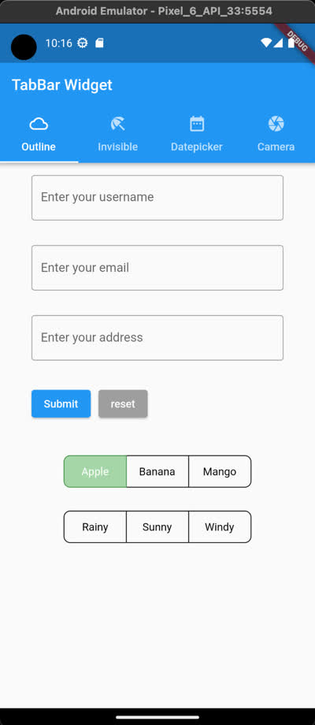
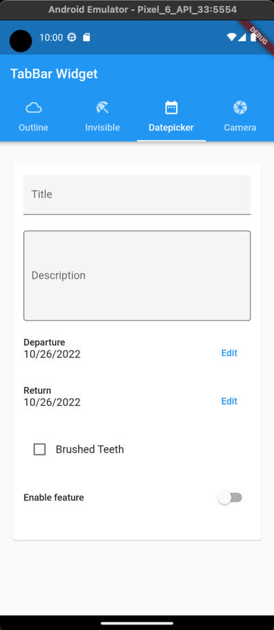
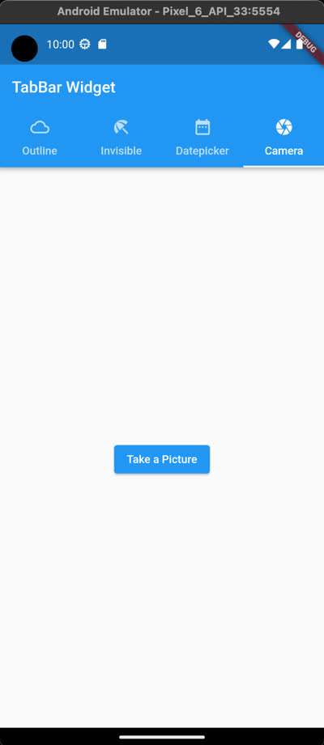

# Flutter Sample Android App

This tutorial shows how to use askui to automate an Android app built with [Flutter](https://flutter.dev/). We provide the source code for the Flutter demo app used in this tutorial ([GitHub repository](https://github.com/askui/flutter-example-automation)). Set up the demo app by following the instructions below. This tutorial assumes that you already have your Android device prepared. It can be a real Android device or an Android Emulator.

**If you haven't set up your Android device or Emulator yet, [follow this tutorial](setup-android.md).**

This tutorial includes:

* Build and Run the Flutter Demo App
* Set up the ADBKeyboard
* Click/Touch Automation
* Type Automation
* Swipe Automation

## Live Demo in Action (playback speed x3)


## Setup
The source code for the Flutter demo app used in this tutorial is provided in [this repository](https://github.com/askui/flutter-example-automation).

### 1. Build and Run Flutter Demo App
1) [Install Flutter](https://docs.flutter.dev/get-started/install)

2) Clone [this repository](https://github.com/askui/flutter-example-automation) and run `flutter create demo_app` within the directory:

```shell
git clone https://github.com/askui/flutter-example-automation
cd flutter-example-automation
flutter create demo_app
cd demo_app
```

3) Install dependencies for the Flutter demo app:

```shell
# run this command inside the flutter project
# directory `demo_app/`
flutter pub add camera intl
```

4) To use the camera, we need to set the `minSdkVersion` in `android/app/build.gradle`:

```json
// inside the 'android/app/build.gradle' 
// set the 'minSdkVersion' to 21
default config {
  ...
  minSdkVersion 21
  ...
}
```

5) (optional) The app is ready to be built but will throw deprecation warnings. If you want to clear the deprecation warnings, follow this step ([See also this issue.](https://github.com/flutter/flutter/issues/89578#issuecomment-945916643)).

```shell
# change the respective part inside the 'pubspec.yaml'
dependencies:
  camera:
    git:
      url: https://github.com/flutter/plugins
      path: packages/camera/camera
      ref: 9e46048ad2e1f085c1e8f6c77391fa52025e681f
```

6) Run the Android Emulator.

7) Run the demo app:

```shell
flutter run
```

Now you should see the demo app running on your Android device.

2. Setup ADBKeyboard
In this example, we are going to automate the typing on the Android device. To let askui fluently type as desired, we will use a virtual keyboard that handles the keyboard input via adb: [ADBKeyboard.apk](https://github.com/senzhk/ADBKeyBoard)

‍
1) Download the ADBKeyboard package (Important: Version 2.0): [Link to GitHub Repository](https://github.com/senzhk/ADBKeyBoard/releases/tag/v2.0)

2) Unzip it.

3) Find your device:

```shell
# Make sure that your Android device is connected, and the USB debugging mode is enabled
adb devices
```

4) Install the ADBKeyboard on the device:

```shell
# inside ADBKeyBoard-2.0/
adb -s <your device id> install ADBKeyboard.apk
```

5) Configure the ADB Keyboard:

```shell
# inside ADBKeyBoard-2.0/
adb -s <your device id> shell settings put secure default_input_method com.android.adbkeyboard/.AdbIME
```

6) Enable the ADB Keyboard:

```shell
# inside ADBKeyBoard-2.0/
adb -s <your device id> shell ime enable com.android.adbkeyboard/.AdbIME
```

7) To check if it is enabled:

Click on a textfield in an app and see if the `ADB Keyboard {ON}` notification is shown at the bottom of the screen.

## 3. Setup askui
1) Setup askui by following the [Getting Started Guide](../02-Getting%20Started/getting-started.md).

2) We need to run the UiController directly with an extra argument to specify the runtime mode, as the current version of askui(version 0.7.2) doesn't provide the API for running it with the runtime argument yet.
From within your npm project path, go to the directory that contains the `askui-ui-controller` binary:

```shell
cd <YOUR_PROJECT_DIRECTORY>/node_modules/askui/dist/release/latest/<YOUR_PLATFORM>
./askui-ui-controller -r android
# for example, macOS: cd node_modules/askui/dist/release/latest/darwin/askui-ui-controller.app/Contents/MacOS/./askui-ui-controller -r android
# If you can't find the binary as described above,
# then you might have askui freshly installed and haven't run it yet.
# The binary gets downloaded as the askui code runs.
# Run the command below to run the askui code:
npx jest test/my-first-askui-test-suite.test.ts --config ./test/jest.config.ts
```

If you got them both (emulator and UiController) running, then we are ready to go for the UI automation.

‍
3) You need to deactivate a few lines of the code in `test/helper/jest.setup.ts` that is running the UiController, because we are already running it manually in the previous step:

```typescript
// file location: test/helper/jest.setup.ts
// comment out every line that uses uiController

import { UiControlClient, UiController } from 'askui';

// uiController: UiController;

let aui: UiControlClient;

jest.setTimeout(60 * 1000 * 60);

beforeAll(async () => {
//   uiController = new UiController({
//     /**
//      * Select the display you want to run your tests on, display 0 is your main display;
//      * ignore if you have only one display
//      */
//     display: 0,
//   });

//   await uiController.start();

aui = await UiControlClient.build({
    credentials:{
        workspaceId: 'YOUR_WORKSPACEID_FROM_USER_PORTAL',
        token: 'YOUR_TOKEN_FROM_USER_PORTAL',
    }
});

await aui.connect();
});

afterAll(async () => {
//   await uiController.stop();

aui.close();
});

export { aui };
```

## Breaking Down the askui Code
This chapter will walk you through the provided `askui-test/demo-automation.ts` step by step.
The code is divided into three parts, and each part automates a different tab within the demo app:

* **Outline tab**: Find a textfield and type in characters.
* **Datepicker tab**: Select a desired date within the date picker widget.
* **Camera tab**: Open the camera and push the record button.

## 0. General Tips for Using askui as a More Friendly Tool:
1) Try to annotate : Use `await aui.annotateInteractively()` or `await aui.annotate()` in order to see how askui is understanding the visible elements on your screen. By using `await aui.annotate()`, the result of the annotation will be saved in the folder `report/` as an HTML file.

2) **Be aware of the screen size of your device**: askui understands your application based on the screen shown and captured. Therefore, on some occasions, you may want to know your screen size to e.g. properly scroll or swipe within your application. You may need to change the numbers for the `input swipe` command within the provided code so that it suits the screen size of your device.

3) **Try to select the elements by their text**

*tip: If you are using a device with a bigger screen e.g. Tablet, then the screen of your device (real Android device or emulator) might be big enough to see the whole page without scrolling.*

### 1. Click and Type
The code is within the file `askui-test/demo-automation.ts`. Copy and paste the code into your askui code.

We start the run from the very first tab of our demo app.



To type into a textfield, we first need to get focus on the desired textfield. We can achieve it by running the code below:

```typescript
// click on the textfield and type characters
// repeat this as many times as the textfields
await aui.click().text().withText('Enter your username').exec();
await aui.type('askui').exec();
```

As we have multiple of textfields in our demo app, we can iterate the same procedure for each of them:

```typescript
// click on the textfield and type characters
// repeat this as many times as the textfields
await aui.click().text().withText('Enter your username').exec();
await aui.type('askui').exec();

// click and type the email address
await aui.click().text().withText('Enter your email').exec();
await aui.type('askui@askui.com').exec();

// Click and type the address
await aui.click().text().withText('Enter your address').exec();
await aui.type('Haid-und-Neu-Straße 18').exec();

// Pressing enter is the equivalent of pressing the return button on the on-screen-keyboard
// This gets rid of the focus from the textfield
await aui.pressAndroidKey('enter').exec();
```

After filling up the textfields, we can push the buttons at the bottom of the page:

```typescript
// Press the 'Submit' button
await aui.click().text().withText('Submit').exec();

// We will have a popup window that has two buttons. Press the 'Refuse' button
await aui.click().text().withText('Refuse').exec();

// Here we press multiple toggle buttons one by one
await aui.click().text().withText('Banana').exec();
await aui.click().text().withText('Mango').exec();
await aui.click().text().withText('Sunny').exec();
await aui.click().text().withText('Rainy').exec();
await aui.click().text().withText('Windy').exec();

// Attention for swiping!
/*  Swipe/scroll within the page
  - execOnShell() can run shell commands within the device via adb.
  - Note that, you have to adjust the four numeric parameters,
          in order to make it fit to your device's screen.
  - The syntax is:
      input swipe <startX> <startY> <endX> <endY>
  - Depending on the screen size of your device,
          the coordinates should stay within the scrollable/swipeable area of the app.
          i.e. the 'Tabbar' at the top of the demo app is not scrollable.
*/

// Here we swipe the page two times in a row
await aui.execOnShell('input swipe 1000 1000 100 1000').exec();
await aui.execOnShell('input swipe 1000 1000 100 1000').exec();
```

## Datepicker
After running the code above, we should see the demo app swiped to the Datepicker tab.



First, we select and type characters into two different textfields:

```typescript
// First, we type in the desired values into the textfields.
await aui.click().text().withText('Title').exec();
await aui.type('My vacation plan').exec();
await aui.click().text().withText('Description').exec();
await aui.type('0. Drink a lot of water').exec();
await aui.pressAndroidKey('tab').exec();
```

Thereafter, we interact with two different date picker widgets that are represented with edit buttons:

```typescript
// Second, we select a desired date from the Datepicker widget.
// Notice how we select the icon 'chevron right/left' to shift the calendar month.
await aui.click().text().withText('edit').nearestTo().text().withText('Depature').exec(); // this will open up the calendar
await aui.click().icon().withText('chevron right').exec();

// within the calendar, we push the > icon on the top right corner
await aui.click().icon().withText('chevron right').exec();
await aui.click().text().withText('7').exec(); // select 7
await aui.click().text().withText('ok').exec(); // then, press OK

// Repeat the step for the next Datepicker widget.
await aui.click().text().withText('edit').nearestTo().text().withText('Return').exec();
await aui.click().icon().withText('chevron right').exec();
await aui.click().icon().withText('chevron right').exec();
await aui.click().icon().withText('chevron right').exec();
await aui.click().text().withText('5').exec();
await aui.click().text().withText('ok').exec();
```

Let's go further below to the bottom of the page, and then interact with more interfaces:

```typescript
// click and check the checkbox
await aui.click().checkboxUnchecked().nearestTo().text().withText('Brushed Teeth').exec();

// finally, we turn on the switch
await aui.click().switchDisabled().nearestTo().text().withText('Enable feature').exec();

// Swipe the page to the Camera tab
await aui.execOnShell('input swipe 1000 1000 100 1000').exec();
```

## Take a Picture with the Camera
In the final tab **Camera**, we can launch the device's camera and take a picture by pressing the record button.
‍


```typescript
// Click on the button 'Take a Picture', then it will launch the camera
await aui.click().button().contains().text().withText('Take a Picture').exec();

// Notice how we select the record button.
// Our demo-app intends to have the record button in a circular shape.
// So we can look for an icon which is a 'circle'
// It might be different in other applications.
await aui.click().icon().containsText('circle').exec();
```

## Complete askui Code
This is the complete code that runs askui to automate our workflow:

```typescript
import { aui } from './helper/jest.setup';

describe('jest with askui', () => {
    xit('annotate', async () => {
        await aui.annotateInteractively();
    });

    it('should fill up the textfields and push buttons', async () => {
        // click on the textfield and type characters
        // repeat this as many times as the textfields
        await aui.click().text().withText('Enter your username').exec();
        await aui.type('askui').exec();

        // click on the textfield and type the email        
        await aui.click().text().withText('Enter your email').exec();
        await aui.type('askui@askui.com').exec();

        // Click and type the address
        await aui.click().text().withText('Enter your address').exec();
        await aui.type('Haid-und-Neu-Straße 18').exec();

        // Pressing enter is the equivelant to pressing the return button on the on-screen-keyboard
        // This gets rid of the focus from the textfield
        await aui.pressAndroidKey('enter').exec();

        // Press the 'Submit' button
        await aui.click().text().withText('Submit').exec();

        // We will have a popup window that has two buttons. Press the 'Refuse' button
        await aui.click().text().withText('Refuse').exec();

        // Here we press multiple of toggle buttons one by one
        await aui.click().text().withText('Banana').exec();
        await aui.click().text().withText('Mango').exec();
        await aui.click().text().withText('Sunny').exec();
        await aui.click().text().withText('Rainy').exec();
        await aui.click().text().withText('Windy').exec();


        // Attention for swiping!
        /*  Swipe/scroll within the page
            - execOnShell() can run shell commands within the device via adb.
            - Note that, you have to adjust the four numeric parameters,
            in order to make it fit to your device's screen.
            - The syntax is:
                input swipe <startX> <startY> <endX> <endY>
            - Depending on the screen size of your device,
            the coordinates should stay within the scrollable/swipeable area of the app.
            i.e. the 'Tabbar' at the top of the demo app is not scrollable.
        */

        // Here we swipe the page two times in a row
        await aui.execOnShell('input swipe 1000 1000 100 1000').exec();
        await aui.execOnShell('input swipe 1000 1000 100 1000').exec();
    });


    it('should pick the dates', async () => {
        // First, we type in the desired values into the textfields.
        await aui.click().text().withText('Title').exec();
        await aui.type('My vacation plan').exec();
        await aui.click().text().withText('Description').exec();
        await aui.type('0. Drink a lot of water').exec();
        await aui.pressAndroidKey('tab').exec();

        // Second, we select a desired date from the Datepicker widget.
        // Notice how we select the icon 'chevron right/left' to shift the calendar month.
        await aui.click().text().withText('edit').nearestTo().text().withText('Depature').exec(); // this will open up the calendar
        await aui.click().icon().withText('chevron right').exec(); // within the calendar, we push the > icon on the top right corner
        await aui.click().icon().withText('chevron right').exec();
        await aui.click().text().withText('7').exec(); // select 7
        await aui.click().text().withText('ok').exec(); // then, press OK


        // Repeat the step for the next Datepicker widget.
        await aui.click().text().withText('edit').nearestTo().text().withText('Return').exec();
        await aui.click().icon().withText('chevron right').exec();
        await aui.click().icon().withText('chevron right').exec();
        await aui.click().icon().withText('chevron right').exec();
        await aui.click().text().withText('5').exec();
        await aui.click().text().withText('ok').exec();

        // click and check the checkbox
        await aui.click().checkboxUnchecked().nearestTo().text().withText('Brushed Teeth').exec();

        // finally, we turn on the switch
        await aui.click().switchDisabled().nearestTo().text().withText('Enable feature').exec();

        // Swipe the page to the Camera tab
        await aui.execOnShell('input swipe 1000 1000 100 1000').exec();

    });

    it('should take a picture', async ()=>{
        // Click on the button 'Take a Picture', then it will launch the camera
        await aui.click().button().contains().text().withText('Take a Picture').exec();

        // Notice how we select the record button.
        // Our demo-app intends to have the record button in a circular shape.
        // So we can look for an icon which is a 'circle'
        // It might be different in other applications.
        await aui.click().icon().containsText('circle').exec();
    });
});
```

## Conclusion
After following through this tutorial, you should be able to automate the interaction with the provided demo app. Although this example specifically provides a demo app built with Flutter, the overall method of using askui should also work with any mobile app running on an Android device.

If you got an issue while following this example, or in case you would like to share your use case, don't hesitate to join our [community on Outverse](https://app.outverse.com/askui/community/home)!
